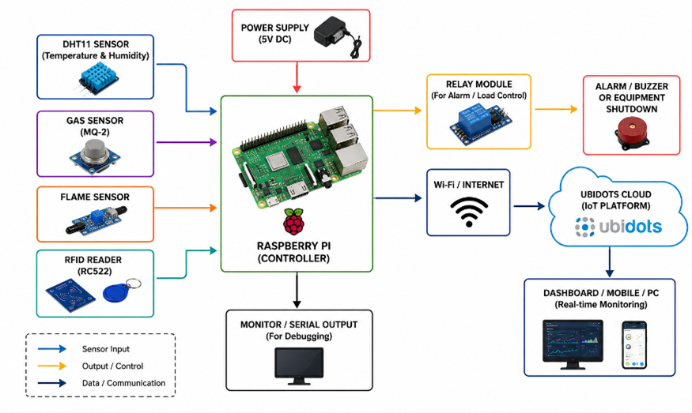
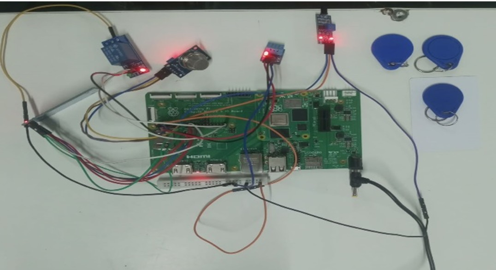
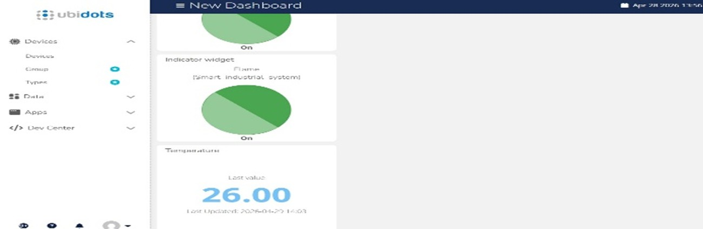

🏭 IoT-Based Smart Industrial Safety & Employee Monitoring System

📌 Project Overview

The **IoT-Based Smart Industrial Safety & Employee Monitoring System** is an intelligent industrial monitoring solution developed using **Raspberry Pi 4**, **RFID technology**, environmental sensors, and cloud-based IoT monitoring.

This system continuously monitors hazardous industrial conditions such as:

* Gas Leakage
* Fire Accidents
* Unauthorized Access
* Unsafe Environmental Conditions

The project provides:

* Real-time monitoring
* Instant emergency alerts
* Automated safety actions
* Cloud-based remote supervision

The system integrates Embedded Systems, IoT, Industrial Automation, and RFID-based employee authentication into a single smart safety platform.


🚀 Key Features

✅ Real-time Gas Leakage Detection
✅ Fire and Flame Detection
✅ RFID-based Employee Authentication
✅ Buzzer & LED Emergency Alerts
✅ Relay-based Emergency Shutdown
✅ Cloud Monitoring using Ubidots
✅ Real-time Sensor Data Visualization
✅ Industrial Safety Automation
✅ Remote Monitoring Capability


🛠️ Technologies Used

Hardware Components

| Component      | Description             |
| -------------- | ----------------------- |
| Raspberry Pi 4 | Main Processing Unit    |
| MQ Gas Sensor  | Gas & Smoke Detection   |
| Flame Sensor   | Fire Detection          |
| RFID Module    | Employee Authentication |
| RFID Tags      | Employee Identification |
| Relay Module   | Emergency Control       |
| LED Indicators | Visual Alerts           |
| Buzzer         | Audio Alerts            |


Software & Platforms

* Python Programming
* Raspberry Pi OS
* Embedded Systems
* Ubidots IoT Platform
* GPIO Programming
* RFID Authentication

🧠 System Architecture

🔷 Block Diagram



---

🔧 Hardware Implementation



---

📊 Real-Time Monitoring Output

Serial Monitor Output




Ubidots IoT Dashboard


⚙️ Working Principle

1. The gas sensor continuously monitors harmful gases and smoke.
2. The flame sensor detects fire conditions.
3. RFID module authenticates employees using RFID cards.
4. Raspberry Pi processes sensor data in real time.
5. During hazardous conditions:
   * Buzzer activates
   * LED indicators glow
   * Relay disconnects equipment
6. Sensor data is uploaded to the Ubidots cloud platform.
7. Industrial conditions can be monitored remotely through IoT dashboard.


# 📈 Results Achieved

* Successful gas leakage detection
* Accurate fire detection
* Reliable RFID authentication
* Real-time cloud monitoring achieved
* Emergency alert system tested successfully
* Automated safety response implemented


# 🏭 Applications

* Smart Factories
* Industrial Automation
* Manufacturing Industries
* Chemical Plants
* Worker Safety Systems
* Industry 4.0 Solutions


# 🔮 Future Enhancements

* AI-Based Hazard Prediction
* GSM/SMS Emergency Alerts
* Mobile Application Integration
* Cloud Database Analytics
* Smart CCTV Monitoring
* Predictive Maintenance System


# 📂 Repository Structure

```bash
IoT-Industrial-Safety-Employee-Monitoring-System/
│
├── README.md
├── report.pdf
├── industrial_safety_system.py
├── block_diagram.png
├── hardware_setup.png
├── serial_output.png
└── ubidots_dashboard.png

# 👨‍💻 Author

Harsha Muttanna Goudar
BE – Electrical & Electronics Engineering
S.G. Balekundri Institute of Technology, Belagavi

# 📜 Internship Information

This project was developed during the Embedded Systems & IoT Internship at: Loginware Softtec Pvt. Ltd.

The internship focused on:

* Embedded Systems
* Raspberry Pi
* ESP32 / ESP8266
* STM32
* IoT Cloud Platforms
* Industrial Automation

# ⭐ GitHub Repository

If you found this project useful, consider giving it a ⭐ on GitHub.
